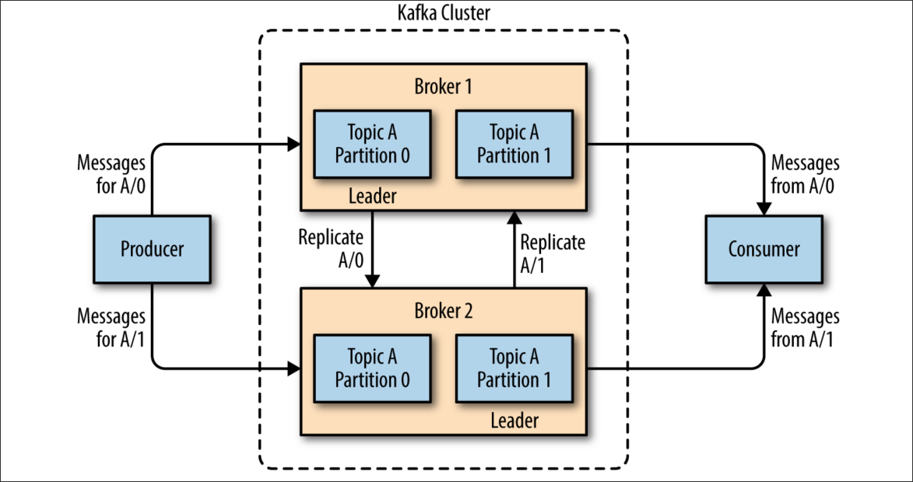

> Legacy snapshot: this Marp-style deck is kept for reference only. The active deck is `slides.md` (Slidev), and legacy GIF assets/scripts were removed.

<!-- font_size: 3 -->

## Organisatorisches

<!-- column_layout: [2, 1] -->
<!-- column: 0 -->

- Podcast: All About Kafka
<!-- speaker_note: Changelog -> gotime 299 von Matthew Boyle, Jon Calhoun, Kris Brandow-->
- Mara + Manuel
<!-- speaker_note: ich -> Aufbau Kafka  Mara -> Kafka Use Cases -->

<!-- column: 1 -->

<!-- reset_layout -->

<!-- end_slide -->

<!-- font_size: 3 -->

## Wieso lohnt es sich zuzuhören?

<!-- alignment: center -->

**80 % der Fortune-100-Unternehmen nutzen Kafka**

<!-- speaker_note: Fortune 100 -> 100 Firmen mit dem größten Einkommen in den USA -->

<!-- column_layout: [1, 1, 1] -->

<!-- column: 0 -->

<!-- column: 1 -->

<!-- column: 2 -->

<!-- reset_layout -->
<!-- end_slide -->

<!-- jump_to_middle -->

<!-- font_size: 5 -->

## Publish/Subscribe

<!-- no_footer -->
<!-- end_slide -->

<!-- font_size: 3 -->

## Publish/Subscribe

<!-- end_slide -->

<!-- font_size: 3 -->

## Publish/Subscribe

<!-- end_slide -->

<!-- font_size: 3 -->

## Publish/Subscribe

<!-- end_slide -->

<!-- font_size: 3 -->

## Publish/Subscribe

<!-- end_slide -->

<!-- font_size: 3 -->

## Kafka

- Publish/Subscribe-Messaging-System
<!-- speaker_note: Kafka = “distributed commit log" ||  “distributing streaming platform.” -->
- Daten werden dauerhaft und in richtiger Reihenfolge gespeichert
<!-- speaker_note: Dateisystem || Datenbank speichern Daten durable, sodass diese bei Problemen wiederhergestellt werden können (DB Log) -->
- Können deterministisch gelesen werden
- Daten können im System verteilt werden
  <!-- speaker_note: Bietet zusätzliche Ausfallsicherheit + scaling-->
  <!-- end_slide -->

<!-- font_size: 3 -->

## Kafka im Überblick

<!-- end_slide -->

<!-- font_size: 3 -->

## Messages

<!-- incremental_lists: true -->

- Dateineinheit = Message
<!-- speaker_note: Vergleichbar mit row/record in einer Datenbank -->
- Message = Byte-Array - Kein spezifisches Format - Optionaler Message Key = Byte-Array - Offset
  <!-- speaker_note: Kafka ist das Format der Nachricht oder des Schlüssels komplett egal! -->
  <!-- end_slide -->

<!-- font_size: 3 -->

## Topics

<!-- incremental_lists: true -->

- Topics = Database Table
- Jedes Topic hat mehrere Partitionen
- Ein Topic kann auf mehrere Server verteilt werden
<!-- end_slide -->

<!-- font_size: 3 -->

## Partition

<!-- incremental_lists: true -->

- kleinste Speichereinheit
- Log-Datei, in die Messages nacheinander hineingeschrieben werden
- Message Key definiert Partition
- Wichtige Merkmale: - Reihenfolge: Pro Partition sind die Nachrichten streng chronologisch sortiert, nicht pro Topic! - Unveränderlichkeit: Einmal geschriebene Daten in einer Partition können nicht mehr geändert werden
<!-- end_slide -->

<!-- font_size: 3 -->

## Topics am Beispiel

<!-- end_slide -->

<!-- font_size: 3 -->

## Batches

<!-- incremental_lists: true -->

- Menge an Messages pro Topic pro Partition
- Effizientere Speicherung von Messages
- Trade-off zwischen Latenz / Throughput
<!-- end_slide -->

<!-- font_size: 3 -->

## Schemas

<!-- incremental_lists: true -->

- Ein konsistentes Datenformat ist wichtig, sodass Sender/Empfänger kommunizieren können
- Versionierung ist wichtig
- Schemas werden meistens in einem zentralen Repo gespeichert
<!-- end_slide -->

<!-- font_size: 3 -->

## Schemas

<!-- incremental_lists: true -->

- JSON
- XML
- Apache Avro
<!-- end_slide -->

<!-- font_size: 3 -->

## Apache Avro

<!-- incremental_lists: true -->

- JSON für Big Data
- Zwei Komponenten
  - Schema
  - Binary Data -> Tatsächliche Information in kleinem, effizientem Format
- Writer -> Benutzt Schema + data = Binary Data
- Reader -> Schema + Binary Data -> Data
<!-- end_slide -->

<!-- jump_to_middle -->

<!-- font_size: 5 -->

## Producers and Consumers

<!-- no_footer -->
<!-- end_slide -->

<!-- font_size: 3 -->

## Producers

<!-- incremental_lists: true -->

- Erstellt neue Messages
- Legt fest auf welches Topic die Message landet
- Legt fest welche Partition die Message bekommt (Optional)
- Auch bekannt als publishers oder writers
<!-- end_slide -->

<!-- font_size: 3 -->

## Consumers

<!-- incremental_lists: true -->

- Für ein Topic subscribed und liest die Messages in der Reihenfolge, in der sie erstellt wurden
- Um Nachrichten nicht doppelt zu lesen, wird das Offset jeder Nachricht gespeichert -> Consumer kann jederzeit neu gestartet werden
- Auch bekannt als subscribers oder readers
<!-- end_slide -->

<!-- font_size: 3 -->

## Consumer Group

<!-- incremental_lists: true -->

- Mehrere Consumers zusammengefasst in einer Gruppe
- Konsumieren zusammen ein Topic jedoch nie eine Partition zusammen!
<!-- end_slide -->

<!-- font_size: 3 -->

## Consumer Group

<!-- end_slide -->

<!-- font_size: 3 -->

## Consumer Group

- Möglichkeit, Consumer horizontal zu skalieren
- Wenn ein Consumer ausfällt, können die anderen neu rebalanced werden
<!-- end_slide -->

<!-- jump_to_middle -->
<!-- font_size: 5 -->

## Brokers and Clusters

<!-- no_footer -->
<!-- end_slide -->

<!-- font_size: 3 -->

## Brokers

- Broker = Ein Kafka Server
- Erhält Nachrichten, assigns offsets to them + Speichert sie
- Liefert Messages an die Consumer
- Kann Tausende Partitionen und Millionen Messages pro Sekunde handeln
<!-- end_slide -->

<!-- font_size: 3 -->

## Clusters

- Brokers sind designt, um im Cluster zu arbeiten
- In einem Cluster ist ein Broker der Controller
  - Automatisch gewählt von den aktuellen Membern des Clusters
  - Assigning partitions to brokers + monitoring for broker failures
- Eine Partition gehört einem Broker = Leader of the Partition - Kann mehreren Brokern zugewiesen werden => Replikation
<!-- end_slide -->

<!-- font_size: 3 -->

## Clusters

<!-- end_slide -->

<!-- font_size: 3 -->

## Retention

- Nachrichten bleiben auch nach dem Lesen verfügbar
- Time-based Retention: Daten werden nach einer Zeit gelöscht
- Size-based Retention: Daten werden gelöscht, wenn das Speicherlimit erreicht ist
- Log Compaction: pro Key bleibt der neueste Stand erhalten
<!-- end_slide -->

<!-- font_size: 3 -->

## Retention Animation

<!-- end_slide -->

<!-- font_size: 2 -->

## Animation Rendering

- Render all deck animations: `python scripts/generate_gifs.py`
- Rendering workflow: Manim scene render -> ffmpeg GIF export
<!-- end_slide -->

<!-- font_size: 3 -->

## Sources

<!-- include: sources.md -->
<!-- end_slide -->
