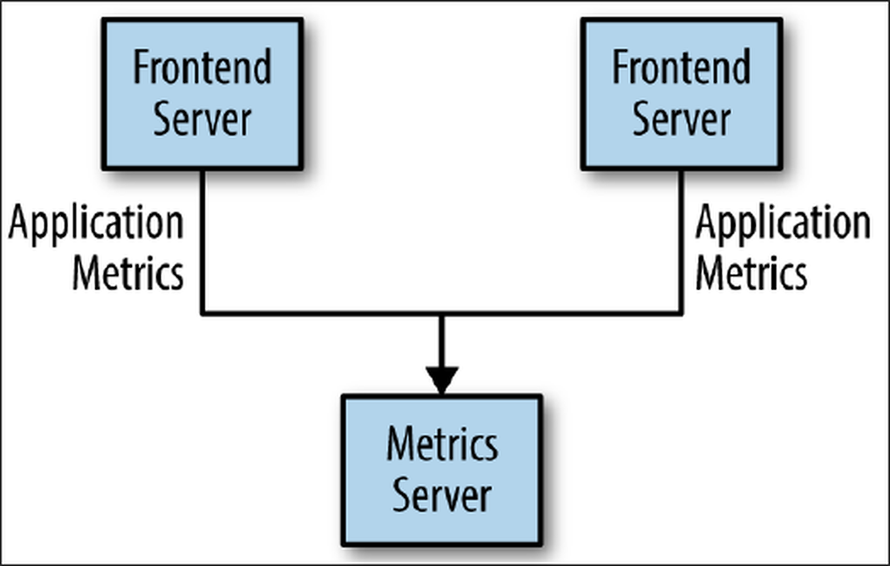
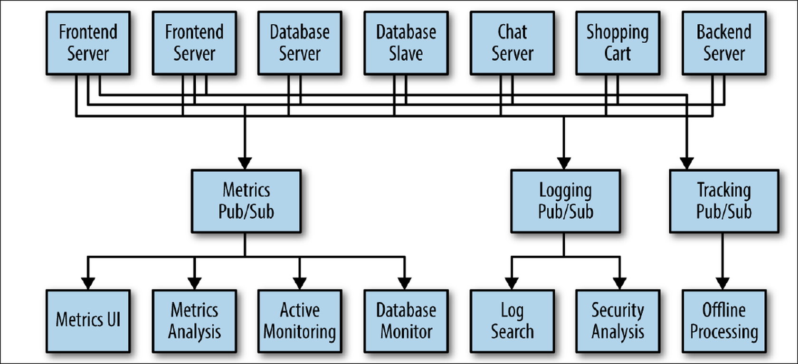

<!-- font_size: 3 -->
Organisatorisches
---
<!-- column_layout: [2, 1] -->
<!-- column: 0 -->
- Podcast: All About Kafka
<!-- speaker_note: Changelog -> gotime 299 von Matthew Boyle, Jon Calhoun, Kris Brandow-->
- Mara + Manuel
<!-- speaker_note: ich -> Aufbau Kafka  Mara -> Kafka Use Cases -->

<!-- column: 1 -->

<!-- reset_layout -->

<!-- end_slide -->

<!-- font_size: 3 -->
Wieso Lohnt es sich zuzuhören?
---

<!-- alignment: center -->
**80 % der Fortune-100-Unternehmen nutzen Kafka**
<!-- speaker_note: Fortune 100 -> 100 firmen mit dem größten Einkommen in den USA -->

<!-- column_layout: [1, 1, 1] -->

<!-- column: 0 -->

<!-- column: 1 -->

<!-- column: 2 -->

<!-- reset_layout -->
<!-- end_slide -->

<!-- jump_to_middle -->

<!-- font_size: 5 -->
Public/Subscription
---
<!-- no_footer -->
<!-- end_slide -->

<!-- font_size: 3 -->
Public/Subscription
---

<!-- end_slide -->

<!-- font_size: 3 -->
Public/Subscription
---

<!-- end_slide -->

<!-- font_size: 3 -->
Public/Subscription
---

<!-- end_slide -->

<!-- font_size: 3 -->
Public/Subscription
---

<!-- end_slide -->

<!-- font_size: 3 -->
Kafka
---
- Publish/Subscribe-Messaging-System
<!-- speaker_note: Kafka = “distributed commit log" ||  “distributing streaming platform.” -->
- Daten werden dauerhaft und in Richtige reihenfolge gespeichert
<!-- speaker_note: Dateisystem || Datenbank speichern Daten durable sodass diese bei Problem wiederhergestellt werden können (DB Log) -->
- Können deterministisch gelesen werden
- Daten können im System verteilt werden
<!-- speaker_note: Bietet zusätzliche ausfallsicherheit + scaling-->
<!-- end_slide -->

<!-- font_size: 3 -->
Messages
---
<!-- incremental_lists: true -->
- Dateineinheit = Message
<!-- speaker_note: Vergleichbar mit row/record in einer Datenbank -->
- Message = Byte-Array
    - Kein Spezifisches Format
    - Optionaler Message Key = Byte-Array
<!-- speaker_note: Kafka ist das Vormat der Nachricht oder Schlüssel komplett egal! -->
<!-- end_slide -->

<!-- font_size: 3 -->
Topics
---
<!-- incremental_lists: true -->
- Topics = Database Table
- Jedes Topic hat mehrere Partitionen
- Ein Topic kann auf mehrere Server verteilt werden
<!-- end_slide -->

<!-- font_size: 3 -->
Partition
---
<!-- incremental_lists: true -->
- kleinste Speichereinheit
- Log-Datei in die Messages nacheinander hineingeschrieben werden
- Message Key definiert Partition
- Wichtige Merkmale:
    - Reihenfolge: Pro Partition sind die Nachrichtien streng chronlogisch sortiert. Nicht pro Topic!
    - Unveränderlichkeit: Einmal geschriebene Daten in einer Partition können nicht mehr geändert werden
<!-- end_slide -->

<!-- font_size: 3 -->
Topics am Beispiel
---

<!-- end_slide -->

<!-- font_size: 3 -->
Batches
---
<!-- incremental_lists: true -->
- Menga an Messages pro Topic pro Partition
- Effizientere Speicherung von Messages
- Tradeoff zwischen Lateny / Throughput
<!-- end_slide -->

<!-- font_size: 3 -->
Schemas
---
<!-- incremental_lists: true -->
- Konsistentes Daten Format ist Wichtig sodass Sender / Empfänger kommunizizieren können
- Versionierung ist wichtig
- Schemas werden meistens in einem zentralen Repo gespeichert
<!-- end_slide -->

<!-- font_size: 3 -->
Schemas
---
<!-- incremental_lists: true -->
- JSON
- XML
- Apache Avro
<!-- end_slide -->

<!-- font_size: 3 -->
Sources
---
<!-- include: sources.md -->
<!-- end_slide -->
